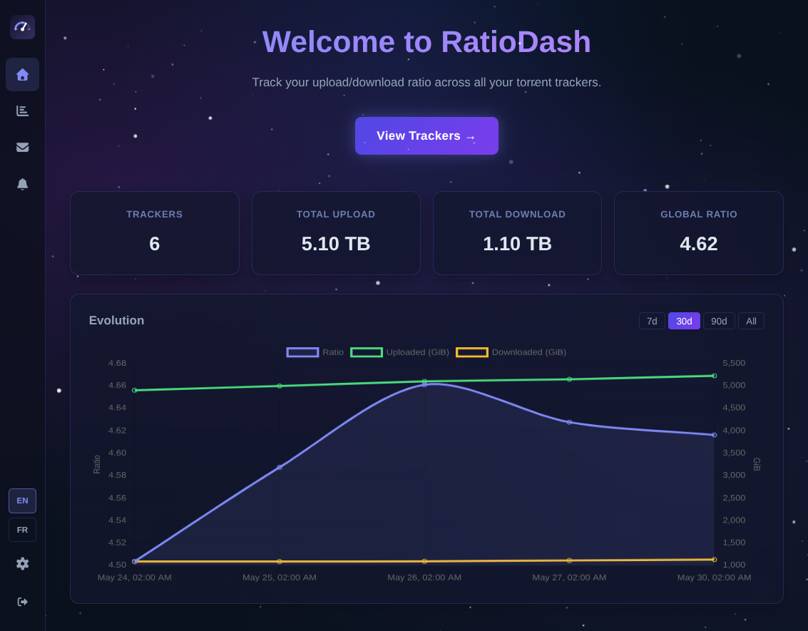

# RatioDash

A self-hosted dashboard for tracking your upload/download ratio across multiple torrent trackers.



## Summary

- [Features](#features)
- [Stack](#stack)
- [Prerequisites](#prerequisites)
- [Getting started](#getting-started)
- [API docs](#api-docs)
- [Supported trackers](#supported-trackers)
- [Project structure](#project-structure)
- [Adding a new resource](#adding-a-new-resource)
- [Environment variables](#environment-variables)
- [AI agents](#ai-agents)

## Features

- Unified dashboard to monitor upload, download, and ratio across multiple trackers
- Automatic periodic refresh so your tracker stats stay up to date without manual checks
- Add and manage tracker accounts from a single interface
- Quick visibility into tracker health and scrape status to spot issues early
- Historical snapshots to follow ratio trends over time
- On-demand reports to review tracker performance in a concise, shareable format
- Configurable alerts for key ratio and tracker conditions so you can act quickly
- Self-hosted deployment so your credentials and data stay under your control
- Fast first-time setup with a built-in onboarding flow

> [!WARNING]
> **Code quality notice**
>
> - **Frontend** — largely AI-generated with minimal human review. Expect inconsistencies in style, structure, and edge-case handling. Treat it as a working prototype.
> - **Backend** — human-controlled and reviewed. Architecture, business logic, and tests follow deliberate design decisions.

## Stack

| Layer      | Technology                                                    |
|------------|---------------------------------------------------------------|
| Backend    | Go · [Uber FX](https://github.com/uber-go/fx) (DI)          |
| HTTP       | [chi](https://github.com/go-chi/chi) · [Huma v2](https://github.com/danielgtaylor/huma) (OpenAPI 3.1 auto-gen) |
| Database   | SQLite · [GORM](https://gorm.io) · [Goose](https://github.com/pressly/goose) migrations |
| Frontend   | Vue 3 · Vite · Pinia · Vue Router · Axios                    |

## Prerequisites

- Go 1.22+ with **gcc** installed (required by `mattn/go-sqlite3` via CGo)
- Node.js 18+

## Getting started

### Option A — Overmind (recommended)

The `Procfile` defines two processes that run concurrently:

| Process | Command | URL |
|---------|---------|-----|
| `api` | `cd backend && go run ./cmd/api` | http://localhost:8080 |
| `web` | `cd frontend && npm run dev` | http://localhost:5173 |

```bash
# Install frontend dependencies first (once)
make install

# Start both processes together
overmind start
```

Useful overmind commands while running:

```bash
overmind connect api   # attach to backend output
overmind connect web   # attach to frontend output
overmind restart api   # restart backend only
overmind stop          # stop everything
```

The Vite dev server proxies `/api/*` to the backend, so no CORS issues during development.

### Option B — Docker Compose

Pre-built images are published to the GitHub Container Registry on every push to `main` and on version tags.

Create a `docker-compose.yml`:

```yaml
services:
  ratiodash:
    image: ghcr.io/jollyroger-1989/ratiodash:main
    ports:
      - "8080:8080"
    volumes:
      - ratiodash_data:/data
    environment:
      SERVER_ADDR: "0.0.0.0:8080"
      DATABASE_URL: "/data/ratiodash.db"
    restart: unless-stopped

volumes:
  ratiodash_data:
```

Then start it:

```bash
docker compose up -d
```

The app is available at **http://localhost:8080**.
The SQLite database is persisted in the `ratiodash_data` named volume.

## API docs

Swagger UI is served at **http://localhost:8080/docs**
Raw OpenAPI 3.1 spec is at **http://localhost:8080/openapi.json**

### External app access

Protected API routes now accept either:

- A JWT from `POST /api/v1/auth/login`
- An API key created via `POST /api/v1/api-clients`

API client keys are intended for machine-to-machine integrations and are shown
only once at creation time.

Example flow:

1. Login as admin and get JWT:

```bash
curl -s -X POST http://localhost:8080/api/v1/auth/login \
  -H 'Content-Type: application/json' \
  -d '{"username":"admin","password":"password123"}'
```

2. Create API key (using admin JWT):

```bash
curl -s -X POST http://localhost:8080/api/v1/api-clients \
  -H "Authorization: Bearer <admin-jwt>" \
  -H 'Content-Type: application/json' \
  -d '{"name":"home-assistant"}'
```

3. Call protected endpoint with the returned API key:

```bash
curl -s http://localhost:8080/api/v1/trackers \
  -H "Authorization: Bearer <api-key>"
```

4. Revoke API key when no longer needed:

```bash
curl -s -X DELETE http://localhost:8080/api/v1/api-clients/{id} \
  -H "Authorization: Bearer <admin-jwt>"
```

## Supported trackers

| Scraper key | Tracker(s) | Auth method | Tested |
|-------------|------------|-------------|--------|
| `abnormal` | ABNormal | Username + password | ❌ |
| `c411` | C411 | Username + password | ✅ |
| `unit3d` | Any UNIT3D-based tracker (e.g. Generation-Free, G3MINI, TeamFlix, The Old School, Seedpool) | API token | ✅ |
| `hdforever` | HD-Forever | Username + password | ❌ |
| `hdonly` | HD-Only | Username + password | ❌ |
| `lacale` | La Cale | Username + password | ❌ |
| `nexum` | Nexum | Username + password | ❌ |
| `nostradamus` | Nostradamus | Password | ❌ |
| `torr9`     | Torr9 | Username + password | ✅ |
| `torrentleech` | TorrentLeech | Username + password | ❌ |
| `tr4ker` | TR4KER | API key | ✅ |
| `yggreborn` | YggReborn | Username (email) + password | ✅ |

To add support for a new tracker, create or update a YAML definition in `backend/scrapers/`.
See [docs/scraper-definitions.md](docs/scraper-definitions.md) for a step-by-step guide.

## Project structure

```
ratiodash/
├── backend/
│   ├── cmd/api/            # Entrypoint — wires FX modules
│   ├── internal/
│   │   ├── domain/         # Entities + repository/service interfaces
│   │   ├── repository/     # GORM implementations
│   │   ├── service/        # Business logic
│   │   ├── handler/        # Huma HTTP handlers + route registration
│   │   └── server/         # chi router setup + HTTP server lifecycle
│   ├── migrations/         # Goose SQL migration files (embedded in binary)
│   └── pkg/
│       ├── config/         # Environment-based configuration
│       └── database/       # DB connection + migration runner
└── frontend/
    └── src/
        ├── assets/
        ├── components/     # Reusable Vue components
        ├── router/         # Vue Router
        ├── services/       # Axios API client
        ├── stores/         # Pinia stores
        └── views/          # Page-level components
```

## Adding a new resource

1. **Domain** – add entity + repository/service interfaces to `internal/domain/`
2. **Repository** – implement in `internal/repository/`, add `fx.Provide` to `module.go`
3. **Service** – implement in `internal/service/`, add `fx.Provide` to `module.go`
4. **Handler** – implement in `internal/handler/`, register routes with `huma.Register`, add `fx.Invoke` to `module.go`
5. **Migration** – add a new `000N_*.sql` file in `migrations/` with `-- +goose Up` / `-- +goose Down` sections
6. **Frontend** – add types to `services/api.ts`, a Pinia store, and Vue views/components

## Environment variables

| Variable       | Default         | Description              |
|----------------|-----------------|--------------------------|
| `SERVER_ADDR`  | `:8080`         | Backend listen address   |
| `DATABASE_URL` | `ratiodash.db`  | SQLite file path         |

## AI agents

This project uses `AGENTS.md` files to give AI coding assistants (GitHub Copilot, Claude, etc.) structured context about the codebase. Each file is scoped to its directory and describes conventions, patterns, and step-by-step instructions relevant to that layer.

| File | Scope |
|------|-------|
| [`AGENTS.md`](AGENTS.md) | Root — overall architecture, stack, running instructions, commit conventions |
| [`backend/AGENTS.md`](backend/AGENTS.md) | Backend — FX module wiring, adding scrapers, adding domain objects |
| [`backend/internal/handler/AGENTS.md`](backend/internal/handler/AGENTS.md) | HTTP handlers — Huma registration, request/response patterns |
| [`backend/internal/repository/AGENTS.md`](backend/internal/repository/AGENTS.md) | Repositories — GORM conventions, migration pairing |
| [`backend/internal/service/AGENTS.md`](backend/internal/service/AGENTS.md) | Services — business logic patterns |
| [`backend/internal/notifier/AGENTS.md`](backend/internal/notifier/AGENTS.md) | Notifiers — adding new notification backends |
| [`frontend/AGENTS.md`](frontend/AGENTS.md) | Frontend — Vue 3 conventions, store patterns, API client usage |

When asking an agent to work on a specific layer, pointing it to the relevant `AGENTS.md` gives it enough context to follow project conventions without needing to read the entire codebase.


